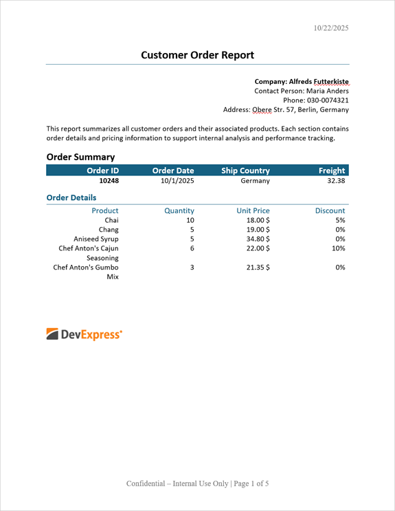

<!-- default badges list -->

<!-- default badges end -->

# Word Processing Document API - Generate, Populate, and Export Master-Detail Invoices

This example demonstrates the use of the [Word Processing Document API](https://docs.devexpress.com/OfficeFileAPI/17488/word-processing-document-api)'s Mail Merge functionality to generate invoices from master-detail templates.

> [!Important]  
> The Universal Subscription or an additional Office File API Subscription is required to use this example in production code. For pricing information, please refer to the following page: [DevExpress Subscription](https://www.devexpress.com/buy/winforms-wpf-blazor-asp-net-maui/)

## Implementation Details

Word Processing Document API allows you to perform mail merge with master-detail templates. The ``TableStart:Name`` and ``TableEnd:Name`` merge fields define master and detail regions. The region name should match the group or table name in your data source. 

 Call the [RichEditDocumentServer.CreateMailMergeOptions()](https://docs.devexpress.com/OfficeFileAPI/DevExpress.XtraRichEdit.RichEditDocumentServer.CreateMailMergeOptions) method to create a new [MailMergeOptions](https://docs.devexpress.com/OfficeFileAPI/DevExpress.XtraRichEdit.API.Native.MailMergeOptions) object. This object contains mail merge options. Specify the object's [DataSource](https://docs.devexpress.com/OfficeFileAPI/DevExpress.XtraRichEdit.RichEditMailMergeOptions.DataSource) property to set the mail merge database. This example uses sample `NWind` data converted to a flat JSON database file.
 
 Pass the `MailMergeOptions` object as the [RichEditDocumentServer.MailMerge](https://docs.devexpress.com/OfficeFileAPI/DevExpress.XtraRichEdit.RichEditDocumentServer.MailMerge.overloads) method parameter to apply specified options. 

## Files to Review:

* [NWindData.cs](./CS/NWindData.cs) (VB: [NWindData.vb](./VB/NWindData.vb))
* [Program.cs](./CS/Program.cs) (VB: [Program.vb](./VB/Program.vb))

## Documentation

 * [Mail Merge in Word Processing Document API](https://docs.devexpress.com/OfficeFileAPI/15277/word-processing-document-api/mail-merge)

## More Examples

* [How to Automate Mail Merge: Generate, Populate, and Export Documents](https://github.com/DevExpress-Examples/word-document-api-mail-merge)
 
<!-- feedback -->
## Does this example address your development requirements/objectives?

 

(you will be redirected to DevExpress.com to submit your response)
<!-- feedback end -->

